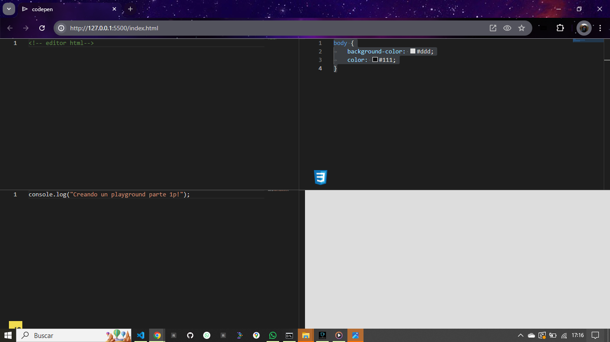

# Code Pen - Editor de Código Interactivo

Code Pen es un editor de código interactivo diseñado para escribir y visualizar HTML, CSS y JavaScript en tiempo real. Ideal para prototipos rápidos y pruebas de código.

## Características Principales

- **Interfaz de Usuario Amigable:** Diseño intuitivo que facilita la escritura y edición de código.
- **Soporte para HTML, CSS y JavaScript:** Editores separados con resaltado de sintaxis para cada lenguaje.
- **Vista Previa en Tiempo Real:** Observa los cambios instantáneamente mientras editas.
- **Tema Oscuro:** Optimizado para trabajar cómodamente en entornos con poca luz.
- **Emmet Integrado:** Acceso rápido a snippets y atajos para HTML y CSS.

